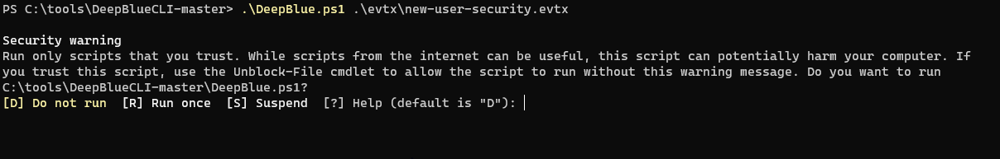

# Deep Blue CLI Tool

As part of the fantastic Antisyphon training with John Strand, I got to use Deep Blue CLI Tool which is great from a tactical Incident Response perspective.

First we navigated to the tools directory on the VM:

C:\tools>cd \tools\DeepBlueCLI-master C:\tools\DeepBlueCLI-master>powershell

PS C:\tools\DeepBlueCLI-master> Set-ExecutionPolicy unrestricted

Attackers may well try to add additional users on to a system they have compromised to enable a level of persistence that they perhaps would not gain with malware. By creating an extra user account it allows them to blend in!

 

 

Now, let’s run a check in the .evtx files for adding a new user:

PS C:\tools\DeepBlueCLI-master>.\DeepBlue.ps1 .\evtx\new-user-security.evtx

 

 

Next, we looked at an event log with a password spray attack. 

PS C:\tools\DeepBlueCLI-master>.\DeepBlue.ps1 .\evtx\smb-password-guessing-security.evtx

Look at the number of login failures!

 

 

The next command showed how to detect a password spray attack:

PS C:\tools\DeepBlueCLI-master>.\DeepBlue.ps1 .\evtx\password-spray.evtx

 

 

Now we can see the host name, we can further investigate the compromise, isolate certain hosts and perform full forensics.

Hope you enjoyed the walkthrough of the project!

